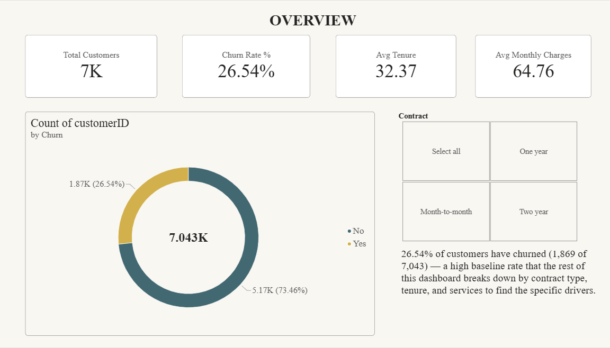
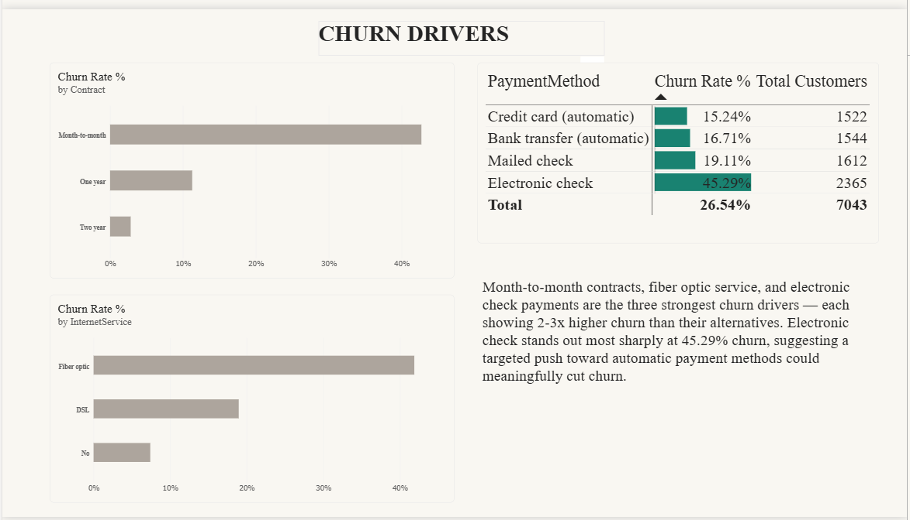
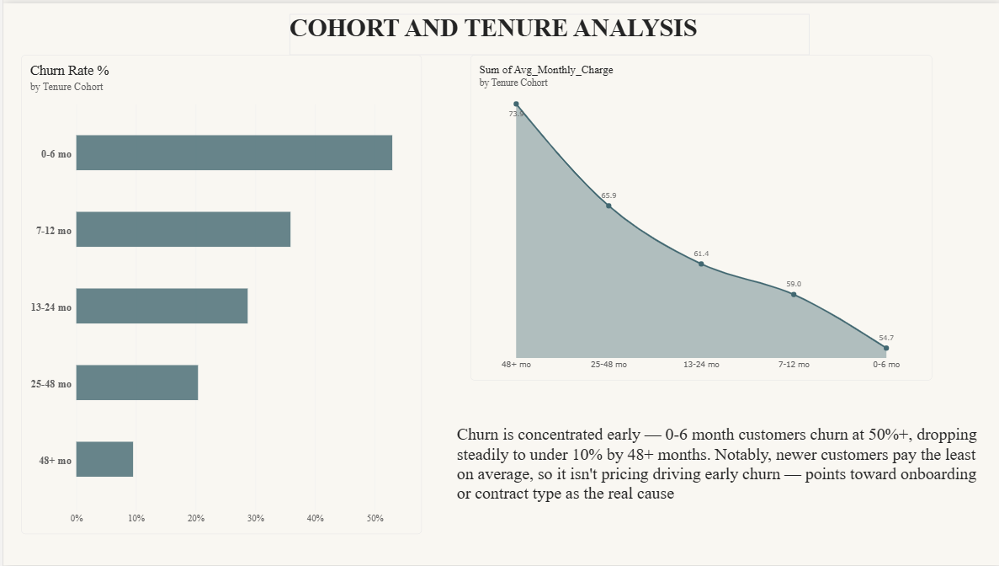
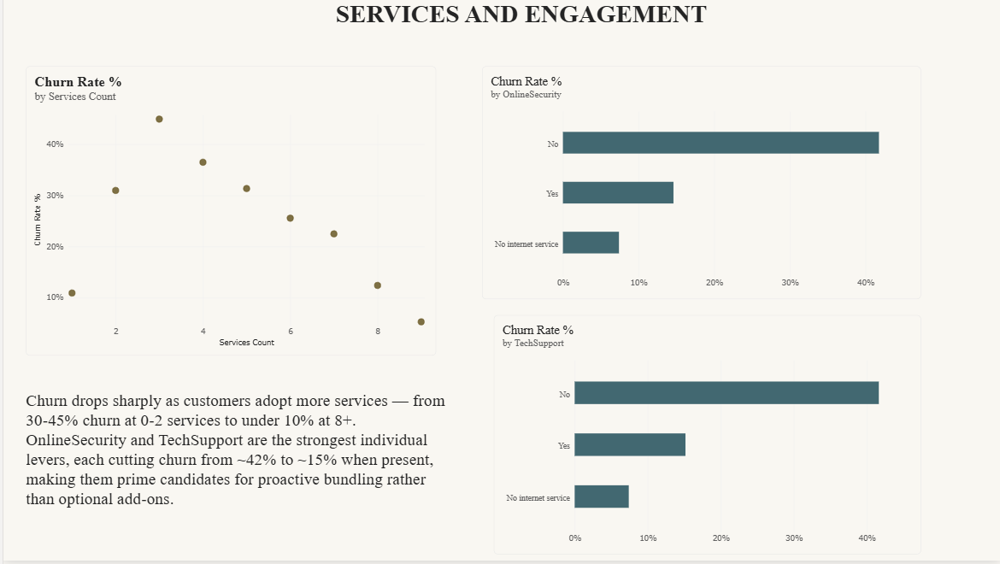
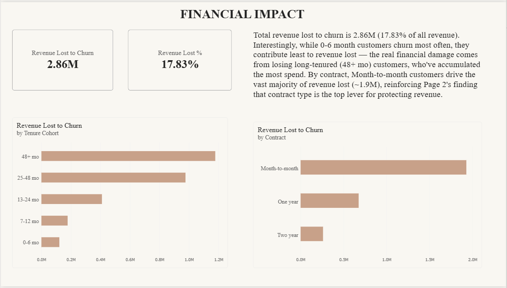

# Task 2: Customer Retention & Churn Analysis

## Problem
Understand why subscription customers leave, which segments are most at
risk, and what the churn costs the business.

## Dataset
[Telco Customer Churn (Kaggle)](https://www.kaggle.com/datasets/blastchar/telco-customer-churn),
7,043 customers with demographics, services, contract and churn status.

## Tools
Python (pandas, Google Colab) for cleaning and cohort features.
Power BI Desktop for DAX and a 5-page dashboard.

## Method
1. Fixed TotalCharges (text with blanks) and converted Churn to a binary flag.
2. Engineered tenure cohorts, a services-count feature and average charge.
3. Built a cohort retention table and a churn-by-segment analysis.
4. Quantified revenue lost to churn.

## Key Insights
**Overview:** 26.54% of customers churned (1,869 of 7,043), about 1 in 4.

**Churn Drivers:** Contract type is the strongest driver. Month-to-month
churn is ~43% vs ~11% (one-year) and under 3% (two-year). Fiber optic churn
is ~42% vs ~19% for DSL. Electronic check users churn at 45.29%, about 3x
any other payment method.

**Cohort & Tenure:** 0-6 month customers churn above 50%, dropping below 10%
by 48+ months. New customers pay the lowest average monthly charge, so early
churn is not a pricing issue.

**Services & Engagement:** Churn falls as customers adopt more services.
Customers without OnlineSecurity or TechSupport churn at ~42% vs ~15% with
them. Recommend bundling both into onboarding.

**Financial Impact:** $2.86M in revenue lost to churn (17.83% of total).
0-6 month customers churn most often but cost the least; 48+ month
customers cost the most because of accumulated spend. Month-to-month
customers drive ~$1.9M of the loss.

## Dashboard Preview

Full export: [dashboard PDF](dashboard/Future_Interns_Task2.pdf).
Interactive file: `dashboard/Task2.pbix`.

---
Future Interns Data Science & Analytics Internship
